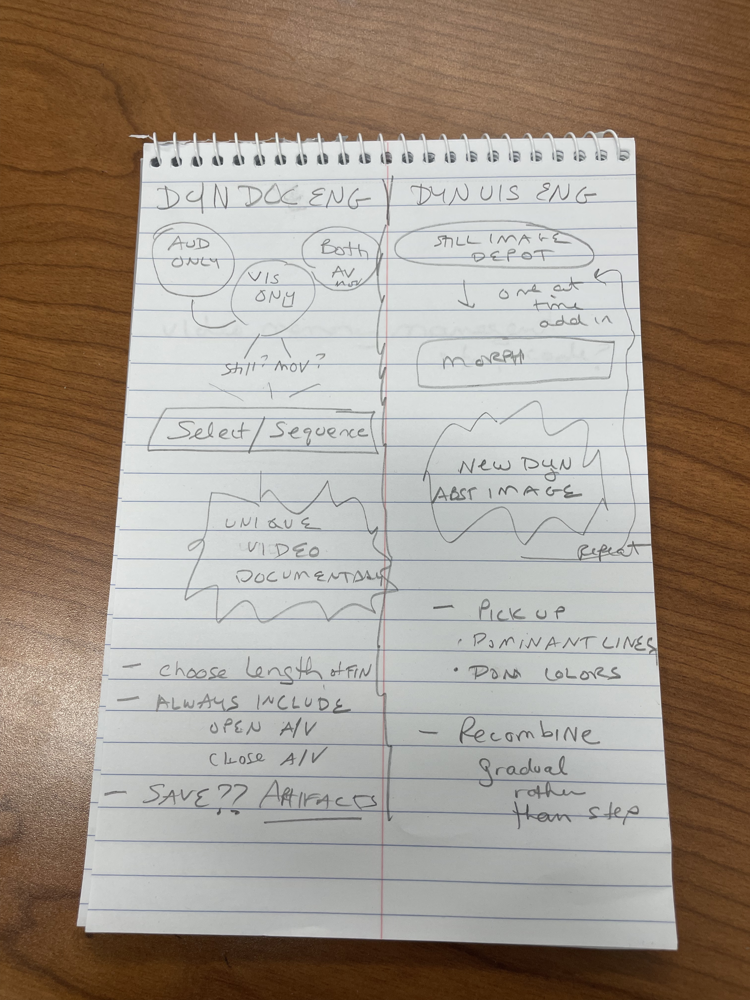
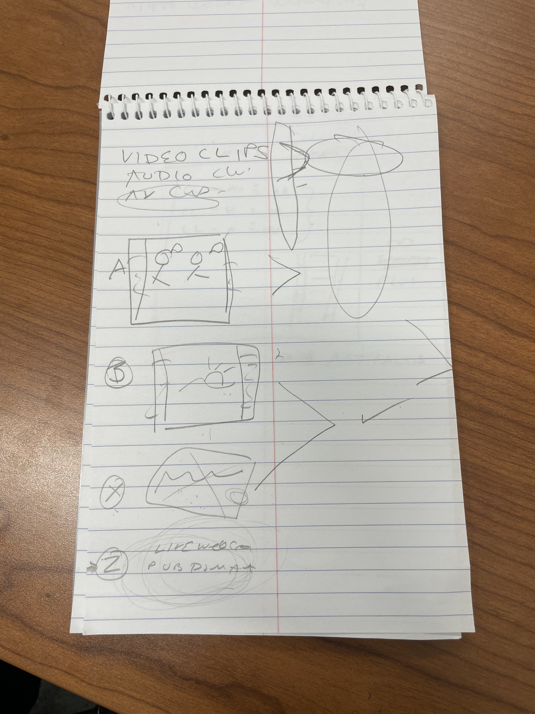
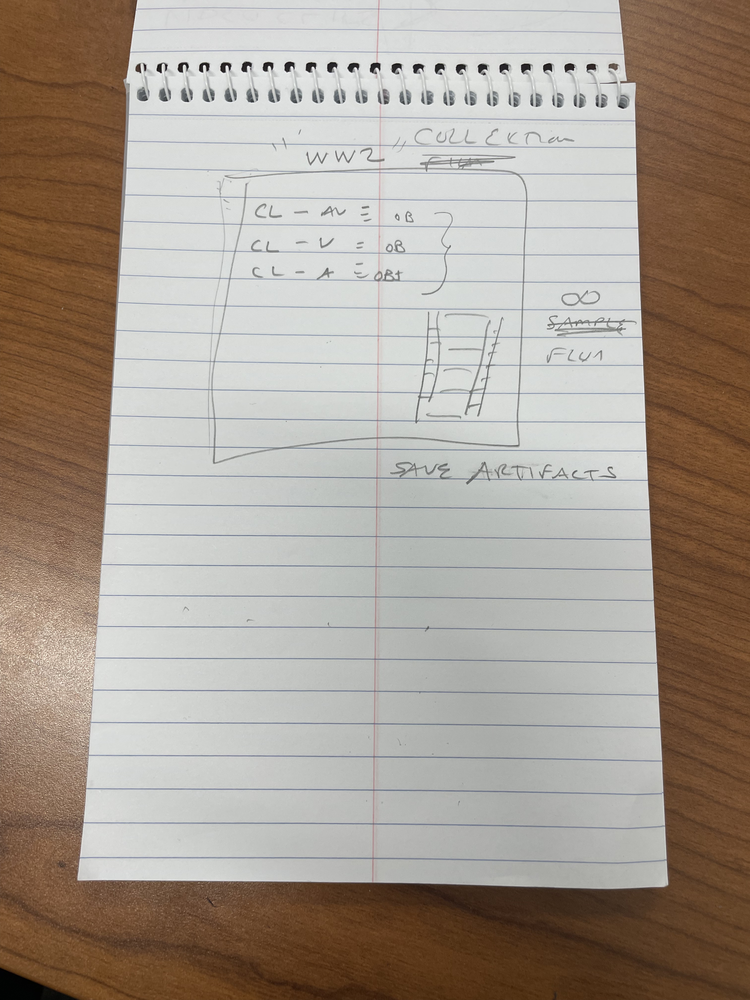

# Dynamic Documentary Engine

An AI-powered generative documentary engine that dynamically assembles films from a collection of modular media artifacts with no two screenings ever being the same.

**IST 495 Research Internship — Penn State University, College of IST**

**Student:** Oluwafemisola David Ademoye

**Supporting Student:** Omotola Ajibike Ajao

**Supervisor:** Dr. Betsy Campbell, Associate Teaching Professor, College of Information Sciences and Technology (IST).

---

## Overview

Inspired by the *Eno* documentary (2024) and its Brain One engine built by Brendan Dawes, this engine uses AI as a director by pulling from a curated collection of modular media artifacts and dynamically assembling them into a unique film on every run. No human curation happens at runtime. The engine decides.

All sequencing logic is creative code — and selection decisions are driven entirely by metadata rules, pacing arc, mood transition logic, and weighted random selection. With no external AI engines utilized.

The project also explores whether modern AI tooling can replicate and extend the generative documentary approach — making it accessible, extensible, and applicable to new collections beyond a single film.

---

## How It Works

Each time the engine runs, it:

1. Reads a **collection** of tagged media **artifacts** (A-roll, B-roll, X-roll)
2. Accepts a target runtime in seconds (1–9999) to control film length
3. Uses rule-based sequencing logic to select and order artifacts based on metadata
4. Always opens and closes with designated opening/closing A/V artifacts
5. Pairs B-roll artifacts with X-roll artifacts to ensure every video clip has audio
6. Assembles the sequence into a rendered **film** via FFmpeg
7. Saves the generated film for analytical review

---

## Terminology

| Term | Definition |
|------|------------|
| **Collection** | The full curated set of media artifacts for a given project (e.g. a WW2 documentary collection) |
| **Artifact** | A single media module within a collection — an A-roll, B-roll, or X-roll clip |
| **Film** | The unique rendered output produced by the engine from a collection |

### Artifact Types

| Type | Description |
|------|-------------|
| **A-roll** | Main footage — synchronized audio and video. Stands alone. |
| **B-roll** | Supplemental video — no audio track. Always paired with an X-roll. |
| **X-roll** | Pure audio only — narration, ambient sound, music. Layered over B-roll. |

All artifacts are tagged with structured JSON metadata that drives the sequencing engine's decisions.

---
## Runtime Control

The engine accepts a `target_duration` parameter in seconds to control the total length of every generated film:

- Supports values from **1 to 9999 seconds**
- Supports both short-form clips and full-length feature documentaries
- The sequencing engine uses the target duration to shape pacing arc decisions throughout the film

---

## B-roll and X-roll Pairing

B-roll artifacts carry video but no audio. Whenever the engine selects a B-roll artifact, it immediately pairs it with an X-roll artifact to provide the audio layer. The FFmpeg assembler overlays the two tracks during rendering. A-roll artifacts always stand alone as they carry synchronized audio and video.

---

## Collection Structure

Each collection follows a class-based hierarchy:

```
Collection (e.g. "WW2")
├── CL-AV  →  A-roll artifacts (synchronized audio + video)
├── CL-V   →  B-roll artifacts (visual only — paired with X-roll)
└── CL-A   →  X-roll artifacts (audio only - layered over B-roll)
```

Every collection includes designated **opening** and **closing** A/V artifacts that will bookend every generated film regardless of what the engine selects in between.

---

## Project Structure

```
dynamic-documentary-engine/
├── assets/                   # Media artifact library (organized by collection)
├── metadata/                 # JSON metadata schema and tagged artifact index
├── engine/                   # Python sequencing engine (creative code only)
│   ├── __init__.py           # Package entry point
│   ├── sequencer.py          # Main sequencing coordinator
│   ├── rules.py              # Pacing arc, no-repeat, and runtime rules
│   ├── artifact_selector.py  # Weighted selection and mood transition logic
│   └── collection_loader.py  # Collection index loader and validator
├── pipeline/                 # FFmpeg rendering pipeline
│   └── assembler.py          # Clip concatenation and audio mixing
├── web/                      # React/Flask web interface
│   ├── frontend/             # React director's console
│   └── backend/              # Flask API server
├── films/                    # Generated film outputs (analytical review only)
├── docs/                     # Technical documentation and research report
└── README.md
```

---

## Deliverables

- [x] Project architecture and meeting documentation
- [x] GitHub repository setup
- [x] Metadata schema (JSON) for A-roll, B-roll, and X-roll artifacts
- [ ] Sample collection (10–20 artifacts, self-recorded + public domain)
- [ ] Python sequencing engine (rule-based + AI logic)
- [ ] FFmpeg rendering pipeline
- [ ] React/Flask web interface
- [ ] Technical documentation report targeting academic publication
- [ ] Generated film artifacts saved for analytical review

**Target completion: To be Decided**

---

## Technical Stack

- **Python** — sequencing engine and pipeline logic
- **FFmpeg** — video and audio assembly and rendering
- **React** — frontend director's console
- **Flask** — backend API
- **Claude API (Anthropic)** — AI-driven artifact selection and metadata enrichment

---

## Inspiration

This project draws directly from the *Eno* documentary (2024), directed by Gary Hustwit, and the Brain One generative engine built by Brendan Dawes — a system that produces a algorithmically different cut of the film at every screening. This project asks: can that same generative approach be rebuilt with modern AI tooling and applied broadly to documentary collections?

---
## Research Context

This project builds directly on the generative documentary approach pioneered by Brain One. For a detailed comparative analysis of the two systems — including shared foundations, key technical differences, the authorship question, emotional arc modeling, and the open-world retrieval vision — see [docs/comparative_analysis_brain_one.md](docs/comparative_analysis_brain_one.md).

---

## Design Sketches

Early hand-drawn sketches documenting the system architecture and design thinking behind the project.

### System architecture — Dyn Doc Engine vs Dyn UIS Engine


### Artifact types — A-roll, B-roll, X-roll funnel


### Collection hierarchy — WW2 collection example


---

## Notes

- Generated films are saved as analytical artifacts for research and critical analysis of the selection process — not for public distribution.
- Hour tracking will be maintained via Google Sheets.
- Bi-weekly check-ins will be completed with Dr. Campbell starting June 2025.
- Potential gallery submission targeting a September deadline (technology and art focused).
